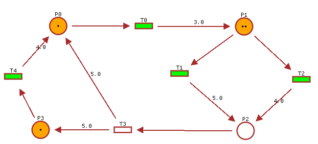

# Timed Petri Net Editor

[This project](https://github.com/Lecrapouille/TimedPetriNetEditor) is a
graphical interface for editing and running (timed) Petri nets and specially timed event
graphs which are a subclass of Petri nets with good mathematics properties for
modeling discrete event systems (DES) with [(max,+)
algebra](https://jpquadrat.github.io/). This tool can generate (max,+) code for
[Julia](https://julialang.org/) used in synergy with
[(max,+)](https://github.com/Lecrapouille/MaxPlus.jl) algebra toolbox running
with the [Julia](https://julialang.org/) language.  This editor also exports the
net as figures (LaTeX, Graphivz) or to other applications (Symfony,
pn-editor ...) or generate C++ code (GRAFCET aka SFC sequential function chart
that could run i.e. on Arduino).

The following picture is an overview of the look of the application. You can
click on it to watch a YouTube showing an example of timed Petri net running.

*Fig 1 - A timed Petri net (made with this editor).*

**Note:** An online version is in gestation. Here is the [link](https://lecrapouille.github.io/TimedPetriNetEditor/TimedPetriNetEditor.html).

- [Why developing another Petri editor?](doc/why.md)
- [Work in progress](doc/wip.md)
- [What are Petri nets, timed Petri nets, timed event graph?](doc/petri.md)
- [How to compile and install the project?](doc/install.md)
- [Command line](doc/cli.md)
- [Mouse and key bindings for the graphical interface](doc/gui.md)
- [Controlling the editor through MQTT commands](doc/mqtt.md)
- [Description of the file format used for saving Petri net](doc/save.md)
- [Exporting the net](doc/export.md)
- [Exporting to C++ code](doc/grafcet.md)
- [Interface with Julia](doc/julia.md)
- [Examples](data/examples/README.md)
- [Related lectures and projects](doc/biblio.md)
