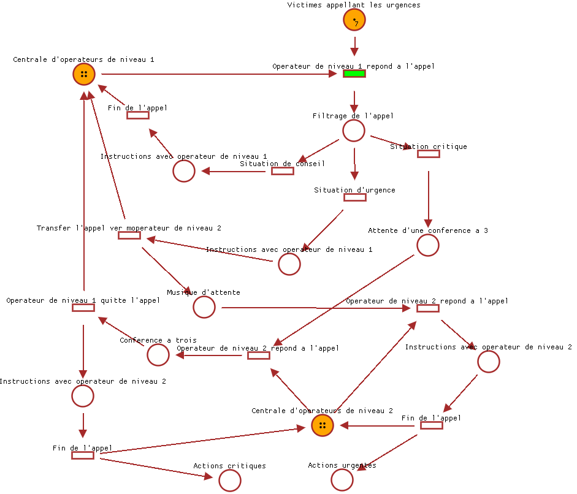

# Timed Petri Net Editor

[TimedPetriNetEditor](https://github.com/Lecrapouille/TimedPetriNetEditor) is a
graphical interface for editing and running Petri nets. It offers some mathematics
tools for timed event graphs which are a subclass of timed Petri nets with good
mathematics properties for modeling discrete event systems with [(max,+)
algebra](https://jpquadrat.github.io/).

**Note:** An online version is in gestation.
Here is the [link](https://lecrapouille.github.io/TimedPetriNetEditor/TimedPetriNetEditor.html).

## What are Petri nets, timed Petri nets, timed event graph, GRAFCET?

You can read this [internal document](doc/petri.md) for more information. Else
you can go to [Related lectures and projects](doc/biblio.md).

## Application Overview

The following picture is an overview of the look of the application. You can
click on it to watch a YouTube showing an example of timed Petri net running
simulating emergency operators (French 911 call center) responding to people in
distress. Operators of level 1 filter non-critical cases (advice). Operators of
level 2 manage other cases: urgency and critical cases. For urgency cases, the
operator of level 1 hangs up when he makes the victim wait the operator of
level 2. For critical cases, the operator of level 1 waits with the victim until
an operator of level 2 pick up before hanging up.

[](https://youtu.be/hOhunzgFpcA)

*Fig 1 - A timed Petri net (made with this editor).*

Why developing another Petri editor? Because:
- This project has started as a continuation of [ScicosLab](http://www.scicoslab.org/)'s
  (max,+) toolbox developed at INRIA (which is no longer developed) which missed
  a graphical Petri editor associated with (max,+) algebra.
- Many Petri net editors in GitHub are no longer maintained (> 7 years) or that
  I cannot personally compile or use (Windows system, Visual Studio compiler,
  C#, Java ..) or the code is too complex (no comments) to add my own extensions. This
  editor can be used for Julia language.

## Compilation, Installation

```sh
git clone https://github.com/Lecrapouille/TimedPetriNetEditor --depth=1 --recursive
cd TimedPetriNetEditor/
make download-external-libs
make compile-external-libs
make -j8
sudo make install
```

## Usage

You can pass a Petri net file to the command line. See this [document](doc/save.md)
concerning the description of the file format used for saving Petri net.

```sh
./build/TimedPetriNetEditor [data/examples/AppelsDurgence.json]
```

See:
- this [document](data/examples/README.md) showing some examples offered with this repo.
- ~~this [document](doc/gui.md) describing the mouse and key bindings for the graphical interface.~~
- ~~this [document](doc/mqtt.md) describing how to control the editor through MQTT commands.~~
- this [document](doc/export.md) Explaining how to export/import the net to/from other applications.

## Debug inside Visual Studio Code

Type F5 key to launch the application with a debugger.
You can modify the `.vscode/launch.json` to indicate 

## Julia integration

The `make install` is needed for its usage with Julia. Once installed in your operating system, you can directly from
the [Julia](https://github.com/JuliaLang/julia) REPL (this part
is described in detail in a dedicated [document](julia.md)):

```sh
julia> include("src/julia/TimedPetriNetEditor.jl")
counter (generic function with 1 method)

julia> pn = petri_net()
PetriNet(0)

julia> editor!(pn)
```

If you do not desire to install TimedPetriNetEditor on your operating system,
you will have to adapt the `DEFINES` in Makefile to indicate the path of the
`data/` folder (to find the fonts). You will also have to manually modify this
Julia file to indicate the correct path of the shared library
`libtimedpetrineteditor.so`.

You can read this [document](doc/julia.md) concerning the API for Julia.
