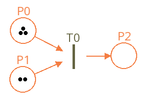

# TimedPetriNetEditor

[This project](https://github.com/Lecrapouille/TimedPetriNetEditor) is a timed
Petri net editor project made in C++11 and displayed with the
[SFML](https://www.sfml-dev.org/index-fr.php).

The following picture is an overview of the look of the Petri net editor. Since
the project is currently in evolution this screenshot may be different. You can
click on the figure to access to a youtube link showing to edit a basic net.

[](https://youtu.be/sKL9lUGeBQs)

## What is Petri net and what should you care of it ?

Petri net is one of several mathematical modeling languages for the description
of distributed systems and synchronization of their processes. It is a class of
discrete event dynamic system.

A Petri net is a directed bipartite graph that has two types of elements, places
`Px` and transitions `Tx`, depicted as white circles and rectangles,
respectively. Arcs, depicted as arrows, are directed and link these nodes but
shall only link two nodes of different type either places to tansitions or
transitions to places. In a timed Petri net this last kind of arc are valuated
with a either time duration or counter. A place can contain any number of
tokens, usually depicted as black circles but here depicted as number. A
transition is enabled if all places connected to it as inputs contain at least
one token and in this case a token is burnt from them and added to each places
connected as outputs to this transition. Usually places states of the systems
and tokens are resources.

Why another Petri editor ? Because:
- Many Petri node editors in GitHub are no longer maintained (> 7 years) or made
  in foreign languages (C#, Java), foreign compiler (Visual Studio) or foreign
  operating systems (Windows) or their code is too complex.
- This editor will complete my
  [MaxPlus](https://github.com/Lecrapouille/MaxPlus.jl) toolbox for Julia (still
  in gestation). Note: in the future I hope to be able to get this C++
  application runable with Julia.

## Compilation

No makefile is used to compile this project since of the tinyness of the code source.
Just a build.sh file is enough:

```sh
git clone https://github.com/Lecrapouille/TimedPetriNetEditor --depth=1
cd TimedPetriNetEditor/src
./build.sh
./TimedPetriNetEditor
```

Prerequisite are:
- g++ or clang++ compiler for C++11.
- SFML: `sudo apt-get install libsfml-dev`

## Usage

- Left mouse button pressed: add a place.
- Right mouse button pressed: add a transition.
- Middle mouse button pressed: start creating an arc from the selected place or transition as origin.
- Middle mouse button released: end creating an arc from the selected place or transition as destination.
Note: the editor will create the arc and the node if no origin or destination node are present or nodes
of the same type.
- `L` key: add an arc with the selected place or transition as origin.
- `Delete` key: remove a place or transition or an arc. FIXME some possible issues.
- `C` key: clear the whole Petri net.
- `M` key: move the selected place or transition.
- `PageUp`, `PageDown` keys: rotate CW or CCW the transition selected by the mouse cursor.
- `+`, `-` keys: add/remove a token on the place pointed by the mouse cursor.
- `R` key: run (start) or stop the simulation.
- `S`, `O` keys: save/open load a Petri net to/from petri.json file.
- `G` key: export the Petri net as Grafcet to C++ header file.

## Limitations / Work in progress

- Interface has no buttons, all actions are done throught mouse et keyboard.
- Node captions and time cannot yet be edited (workaround: save the petri net to json file and edit with a text editor).
- No input node generating tokens is yet made.
- No color for nodes are arcs.
- We cannot control on the file name for saving, loading and exporting the net.
- Possible segfault when adding or removing nodes (references are invalidated).
- WIP: Julia MaxPlus.jl toolbox

## Where are inputs and ouptuts of the Petri net ?

This is currently not managed automatically, and will be done in the future. For
the moment, during the simulation, you can place your mouse cursor to any place
and with `+` key you can add a token this will mimic input generating tokens.

For outputs, simply any Transition not linked to a Place will consum tokens.

## What decision is made when several transitions can burn tokens from the same place ?

Question: In the above screenshot the Place `P1` has two tokens and has two
leaving arcs `P1 -> T1` and `P1 -> T2`. How transitions `T1` and `T2` will burn
tokens in `P1` and therefore to which transition tokens will transit ?

Aanswer: This kind of net is badly designed and should be avoided. The execution
of Petri nets is nondeterministic: when multiple transitions are enabled at the
same time, they will fire in any order. Therefore you should adapt your Petri
net to make deterministic decision possible i.e. event graph is a sub-category
of Petri net.

Nondeterministic execution policy is made at the discretion of the developer of
the editor and you will have different behavior depending on how the editor has
been developped. In our case iteration order for Transitions and arcs only
depends to their order of creation. When several Places are fired, the maximum
possible of tokens will be burn within a single step of the animation cycle but,
internally, we iterate over tokens one by one to help dispatching them over the
maximum number of arcs.  Therefore, in this particular example, since `T1` has
been created before `T2`, the 1st token will go to `T1` and the second will go
to `T2`. If `P1` had a single token, the `T1` will always be choosen.

## Description of the file format used for saving Petri net

JSON file format has been choosen for saving Petri net. This was initially made
to be compatible with [pnet-simulator](https://github.com/igorakim/pnet-simulator)
but it is no longer compatible. Here, an example of its content:

```json
{
  "places": ["P0,204,135,0", "P1,576,132,2"],
  "transitions": ["T0,376,132,0"],
  "arcs": ["P0,T0,0", "T0,P1,3"]
}
```

A Petri net is composed of three arrays (the `[ ]`): `Places`, `Transitions` and
`Arcs`. In this example, is stored in the json file a Petri net made of two
places, one tranisiton and two arcs. Places are defined as follow `"identifier,
X-coord, Y-coord, number of tokens"`. Transitions are defined as follow
`"identifier, X-coord, Y-coord, angle"` and Arcs are defined as follow `"identifier
origin node, identifier destination node"`.

Places and Transitions:
- their unique identifier (string) i.e. `P0`, `P1`, `T0`. First character shall
  be `P` (for Places) or `T` (Transitions).
- their X and Y coordinate (float) in the screeen i.e. `T0` is placed at
  `(376,132)`.
- for places only: the number of tokens they hold i.e. `P0` has 0 tokens
  while `P1` has two tokens.
- for transition only: the angle (in degree) of rotation when displayed.

Arcs:
- have no unique identifier.
- are directed links between two nodes of different type given they unique
  identifier (i.e. the first arc links the origin place `P0` to the destination
  transition `T0`. Therefore an arc cannot link two places or link two
  transitions.
- has unit of time (WIP: to be defined) i.e. the arc `T0 --> P1` has 3 units of
  times (float). This time is only used for arc `Transition` to `Place` this
  means that for arc `Place` to `Transition` this value is not used but given
  in the json file to make easy its parsing.

Note: this project does not use third part json library for a home made token
splitter (see the `class Tokenizer` in the code).

## Generate the implicit dynamic linear max+ system

(In gestation) Will generate a Julia script that this
[package](https://github.com/Lecrapouille/MaxPlus.jl) will understand and will
compute critical cycles of the system.

## Generate C++ code file (Grafcet)

After watching this nice french youtube video https://youtu.be/v5FwJvtGaEw, in
where Grafcet is created manually in C for Arduino, I added my own code
generator for Grafcet, but since my project concerns Petri net which are more
general to Grafcet, you have to complete manually missing methods in your own
C++ to have a functional code :
- `initIO()` to let you init input/output of the system (ADC, PWM, GPIO ...)
- `X0()`, `X1()` ... to let you add the code for the reaction when places are activated.
- `P0()`, `P1()` ... to let you add the code of transitivity of the associated transition.

Here a small example on how to call your grafcet. By default the C++ namespace
is `generated` and the C++ header file is `Grafcet.hpp` but this can be changed
by parameters of the method `PetriNet::exportToCpp(filepath, spancename)`.

```c++
// main.cpp
#include "Grafcet.hpp"

namespace generated {

void Grafcet::initIO() {}
bool Grafcet::T0() const { return true; }
void Grafcet::X0() { std::cout << "Do actions of Place 0" << std::endl; }
void Grafcet::X1() { std::cout << "Do actions of Place 1" << std::endl; }

} // namespace generated

int main()
{
   generated::Grafcet g;
   g.debug();

   // The loop is for simulating time events of the system
   for (size_t i = 0u; i < 10u; ++i)
   {
      g.update();
      g.debug();
   }

   return 0;
}
```

Compilation: g++ -W -Wall --std=c++11 main.cpp -o grafcet

## Related projects

- (en) https://github.com/Lecrapouille/MaxPlus.jl
- (en) https://github.com/igorakim/pnet-simulator
- (fr) https://sites.google.com/view/apimou/accueil
- (fr) Grafcet Arduino https://youtu.be/v5FwJvtGaEw
