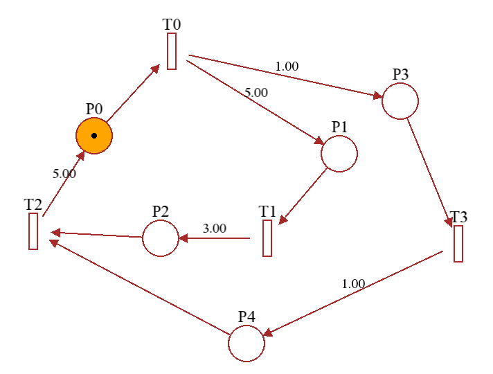
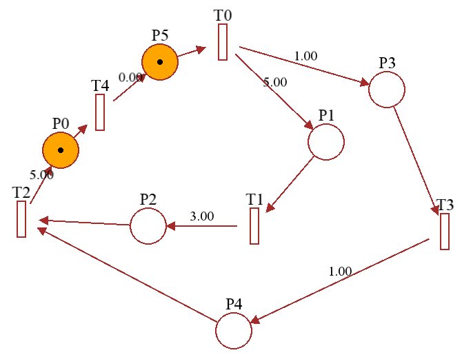
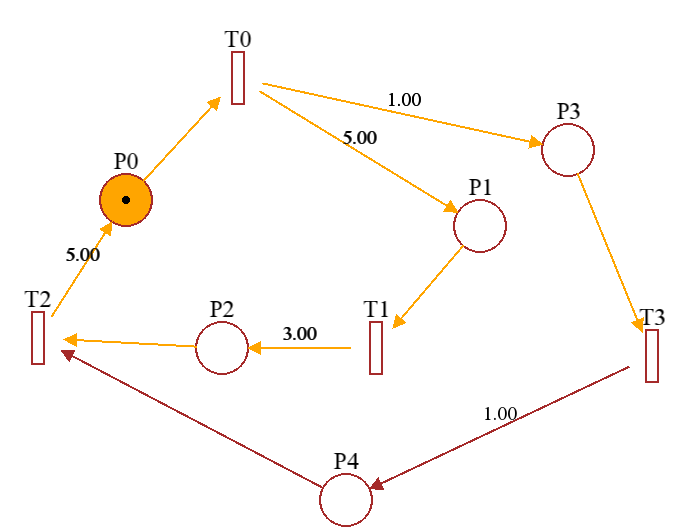
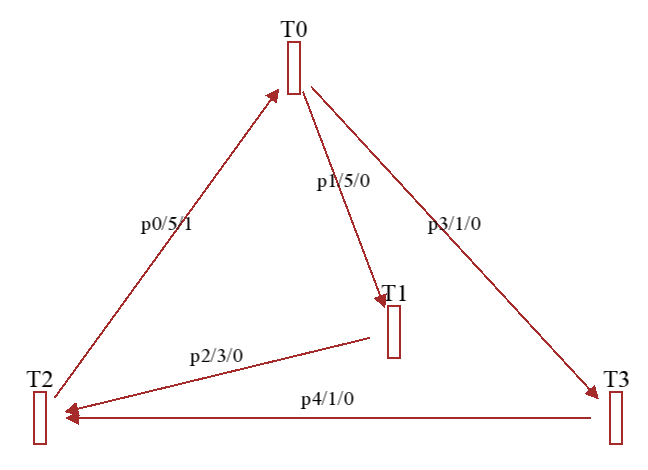
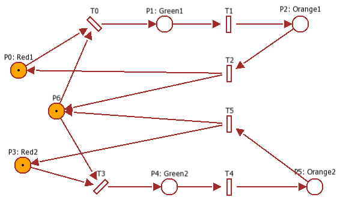
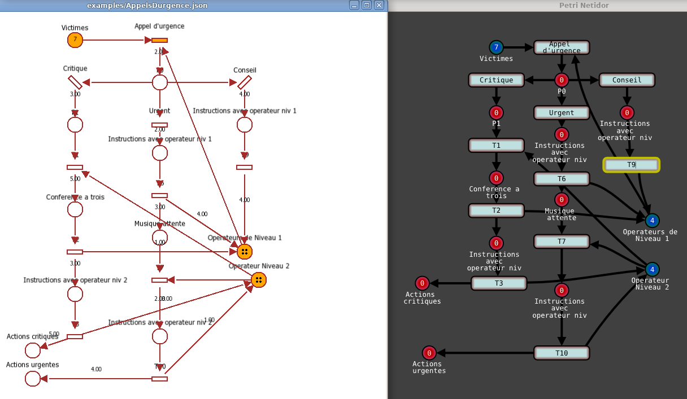

# Timed Petri Net Editor

[](https://github.com/Lecrapouille/TimedPetriNetEditor/actions/workflows/ci.yml)

[This project](https://github.com/Lecrapouille/TimedPetriNetEditor) is a
graphical interface for editing and running Petri nets and specially timed event
graphs which are a subclass of Petri nets with good mathematics properties for
modeling discrete event systems (DES) with [(max,+)
algebra](https://jpquadrat.github.io/). This tool can generate (max,+) code for
[Julia](https://julialang.org/), export figures (LaTeX, Graphivz) and generate
C++ code (GRAFCET aka sequential function chart that could run on Arduino i.e.)
and used in synergy with [(max,+)](https://github.com/Lecrapouille/MaxPlus.jl)
algebra toolbox running with the [Julia](https://julialang.org/) language.

The following picture is an overview of the look of the application. You can
click on it to watch a YouTube showing an example of timed Petri net running.

[](https://youtu.be/hOhunzgFpcA)

*Fig 1 - A timed Petri net (made with this editor).*

A second following YouTube [video](https://youtu.be/wsiF6u7DNVQ) gives a quick
overview of this current document: how to compile and install this project, the
common key and mouse bindings for the GUI and common usage of the Julia API for
(max,+) ...

Why develop another Petri editor? Because:
- There is no Petri editor with (max,+) on GitHub.
- This project is a continuation of [ScicosLab](http://www.scicoslab.org/)'s
  (max,+) toolbox that my father developed at INRIA and which is no longer
  developed.
- Many Petri net editors in GitHub are no longer maintained (> 7 years) or that
  I cannot personally compile or use (Windows system, Visual Studio compiler,
  C#, Java ..) or the code is too complex to add my own extensions.
- Currently, there is no Petri net editors available for Julia.

I tried to make the code as simple as possible with many comments. Do not hesitate
to ask if something is not easily understandable.

## How to compile and install the project?

This project is developed in C++11. The GUI is made with the
[SFML](https://www.sfml-dev.org/index-fr.php). The project is compiled with a
Makefile (no CMake). Optionally, a [Julia 1.x](https://julialang.org/) code
binding the C++ API can be optionally used for working in synergy with my
[(max,+) toolbox](https://github.com/Lecrapouille/MaxPlus.jl).

Prerequisites to compile this project are:
- g++ or clang++ compiler for C++11.
- SFML: `sudo apt-get install libsfml-dev`
- Optionally, libdwarf: `sudo apt-get install libdw-dev` (needed when compiling
  this project in debug mode because it will use
  [backward-cpp](https://github.com/bombela/backward-cpp) for showing the stack
  trace in case of segfault) else in the Makefile replace `BUILD_TYPE = debug`
  by `BUILD_TYPE = release`.
- Optionally, you can install Julia from https://julialang.org/downloads but
  this does not impact the standalone graphical editor.

To download the code source of the
[TimedPetriNetEditor](https://github.com/Lecrapouille/TimedPetriNetEditor)
project, type the following command on a Linux console:

```sh
git clone https://github.com/Lecrapouille/TimedPetriNetEditor --depth=1 --recursive
```

The recursive argument is important: it allows to clone my Makefile helper.

To compile the project:
```sh
cd TimedPetriNetEditor/
make -j8

# Where -j8 to adapt to the number of CPU cores of your computer (8 cores in my case):
```

To run the TimedPetriNetEditor application, you can:
```sh
./build/TimedPetriNetEditor
```

For Julia developers, you can use this editor in synergy with my Julia
[(max,+)](https://github.com/Lecrapouille/MaxPlus.jl) toolbox. The easier way to
achieve it is to you install TimedPetriNetEditor on your operating system (this
will install a shared library needed that can be found by Julia):

```sh
sudo make install
```

For example on Linux:
```
*** Installing: doc => /usr/share/TimedPetriNetEditor/0.1.0/doc
*** Installing: examples => /usr/share/TimedPetriNetEditor/0.1.0/examples
*** Installing: data => /usr/share/TimedPetriNetEditor/0.1.0/data
*** Installing: libs => /usr/lib
*** Installing: pkg-config => /usr/lib/pkgconfig
*** Installing: headers => /usr/include/TimedPetriNetEditor-0.1.0
*** Installing: src => /usr/include/TimedPetriNetEditor-0.1.0
```

Once installed, you can call directly the Petri net editor:
```sh
TimedPetriNetEditor
```

Or directly from the [Julia](https://github.com/JuliaLang/julia) REPL (this part
is described in detail in the dedicated section of this document):

```sh
julia> include("src/julia/TimedPetriNetEditor.jl")
counter (generic function with 1 method)

julia> pn = petri_net()
PetriNet(0)

julia> editor!(pn)
```

If you do not desire to install TimedPetriNetEditor on your operating system, you
will have to adapt the `DEFINES` in Makefile to indicate the path of the `data/`
folder (to find the fonts). You will also have to manually modify this
Julia file to indicate the correct path of the shared library
`libtimedpetrineteditor.so`.

## Command line

The command line is optional. By default type of net is timed Petri.

```sh
TimedPetriNetEditor [-t|-p|-g] [petri.json]
```

Where:
- `[-t|-p|-g]` optional argument to force the type of net:

   - `-t` (default mode) for editing timed Petri nets. In this mode, places can
     have any number of tokens. Arcs `Transition -> Place` have units of time for
     emulating the duration of the process work (arcs `Place -> Transition` have
     implicit 0 of unit time). When running the net simulation, tokens are
     animated and move along arcs at the speed imposed by the arc duration. The
     current unit of time for animation is 1 second. Tokens are shuffled one by
     one on OR-divergence branches.

   - `-p` for forcing the Petri mode. In this mode, places can have any number
     of tokens. Arcs have an implicit unit of time set to 0 (while they
     still animated to make the simulation understandable).  When
     simulating the net, you have to click on transitions to fire tokens. When
     firing, the maximum possible of tokens are burnt at once.

   - `-g` for forcing the GRAFCET mode. This mode is like Petri (no duration on
     arcs) but where places have at max 1 token and tokens are shuffled one by
     one on OR-divergence branches.

- `[petri.json]` is an optional Petri net file to load (JSON format).

Example:

```sh
TimedPetriNetEditor -t examples/Howard2.json
```

## Examples

Some examples are given. See this [document](examples/README.md) for more information.

## Mouse and key bindings for the graphical interface

The editor does not offer any buttons, therefore all actions are directly made
from the mouse and the keyboard (like Emacs but without the Meta key ^^).
- `Escape` quit the application. The unsaved net will be asked for saving before the
  application closes.
- `Left mouse button pressed` on a caption or in duration (*work in progress*) to edit it.
  Press the Enter key to validate the content or press the Escape key to abort.
- `Left mouse button pressed`: add a new place. Note: this action is ignored if
  you are trying to create a node on an already existing node (place or
  transition).
- `Right mouse button pressed`: add a new transition. Note: this action is
  ignored if you are trying to create a node on an already existing node (place
  or transition).
- `Middle mouse button pressed`: start creating an arc either from an existing
  node (place or transition) as the origin or, if no node was selected by the mouse
  cursor, the editor will find the correct type depending on the destination
  node.
- `Middle mouse button released`: end creating an arc either from the selected
  node (place or transition) as the destination or, if no node is selected, the
  editor will find the correct type depending on the origin node. In the case
  you have tried to link two nodes of the same type (two places or two
  transitions) then an intermediate node of the opposite type will be created as
  well as an intermediate arc.
- `Middle mouse scroll`: zoom/unzoom the view.
- `L` key: same action as the middle mouse button.
- `M` key: move the node (place or transition) selected by the mouse cursor.
- Linux: `Delete` key: remove a node (place or transition). Note: since all identifiers
  shall be consecutive (no gaps), the unique identifier of the last created node
  of the same type will receive the unique identifier of the deleted one. Note:
  arcs cannot yet be deleted.
- MacOSX: `\` for deleting node.
- `Z` key: clear the whole Petri net.
- Linux: `+`, `-` keys: add/remove a token on the place selected by the mouse cursor.
- MacOSX: `[`, `]` keys: add/remove a token on the place selected by the mouse cursor.
- `PageUp`, `PageDown` keys: rotate CW or CCW the transition selected by the
  mouse cursor.
- `R` or `SPACE`key: start (run) or stop the simulation. Note: if the simulation
  is stalled (no possible burning tokens), then the simulation will automatically
  stops and returns to the edition mode.
- `S` key: save the Petri net to a JSON file.
- `Shift S` key: save as the Petri net to a JSON file.
- `O` key: load a Petri net from a JSON file.
- `E` key: is the current timed Petri net a timed graph event?
- `C` key: show the first critical circuit if and only if the Petri net is a
  graph event.
- `J` key: export the graph event into a Julia script file (for example named
  `GraphEvent-gen.jl`) if and only if the Petri net is a graph event.
- `X` key: export the Petri net as LaTeX file (for example named `petri.tex`).
- `P` key: export the Petri net as Graphviz file (for example named `petri.gv`).
- `G` key: export the Petri net as Grafcet into a C++ header file (for example
  named `Grafcet-gen.hpp`).
- `K` key: export the Petri net for https://gitlab.com/porky11/pn-editor.
- `F1` key: take a screenshot of the application.
- `H` key: show this help.
- `Up`, `Down`, `Right`, `Left` keys: move the view.

## Work in progress

- Time duration cannot yet be edited. *Workaround:* save the
  Petri net to JSON file and edit with a text editor, then reload the file.
- No input node generating periodically tokens is yet made. *Workaround:* during
  the simulation the user can add a new token to any desired places selected by
  the mouse cursor and the `+` key.
- Showing critical cycles for graph events does not support having transitions
  without predecessors (inputs). For example this Petri net: `T0 -> P0 -> T1`.
  *Workaround:* Either modify your net either by removing your inputs or making
  inputs cycling to themselves with a `-inf` time (which makes duality issues).
- Not all error messages are displayed on the GUI. Read the logs on your Unix
  console.
- We cannot move or zoom the Petri net or select several nodes. We cannot change
  the color of nodes and arcs. We cannot merge several nodes into a sub-net for
  simplifying the net. Cannot delete arcs. Cannot make undo/redo actions.
- Julia API: missing add/remove arcs.

## What are Petri nets, timed Petri nets, timed event graph?

### Petri nets and timed Petri nets

Petri nets are one of several mathematical modeling languages for the
description of distributed systems and synchronization of their processes. It is
a class of discrete event dynamic systems.

A Petri net is a directed bipartite graph that has two types of nodes: places
and transitions respectively depicted as circles and rectangles. A place can
contain zero or any positive number of tokens, usually depicted either as black
circles or as numbers. Arcs, depicted as arrows. An arc allows directing two
nodes of different types: either from a place to a transition or from a
transition to a place. In timed Petri nets, "place -> transition" arcs are
evaluated with a strictly positive duration value which simulates the time needed
by the place to perform the associated action. A transition is activated if all
places connected to it as inputs contain at least one token. When a transition
is activated a token is burnt from each of these places and added to each place
connected as outputs to this transition.

Usually, the numbers of tokens in places depict the states of the systems,
tokens represent the resources of the system and transitions describe the
synchronization of resources (rendez-vous). Petri is another way to model state
machines.

In above figure 1, there are 5 transitions (`T0, T1, T2, T3, T4`) and 4
places (`P0, P1, P2, P3`). Places `P0` and `P1` have 1 token each, the place
`P1` has 2 tokens and the place `P3` has no token. The arc `T0 -> P1` has 3
units of times to simulate the fact that `P1` will need this duration to perform
its action. Transitions `T0, T1, T2, T4` are activated but the transition `T3` is
not activated.

**Note to developers concerning unique identifiers**

In this editor, for a given type (place and transitions), unique identifiers are
unsigned integers `0 .. N`.  Numbers shall be consecutive and without
"holes". This is important when generating graphs defined by adjacency
matrices: indices of the matrix will directly match unique identifiers and
therefore no lookup table is needed. To distinguish the type of node a `T` or
`P` char is also prepended to the number. Arcs have no identifier because their
relation to directing nodes is unique since this editor does not manage multi
arcs. Therefore, when deleting a place (or a transition) the latest place (or
latest transition) in the container gets the unique identifier of the deleted
element to guarantee consecutive identifiers without "holes".

### Dynamic simulation

When running the simulation with this editor, tokens will transit along the arcs of
the net. When transitions are activated, tokens are instantaneously burnt from
places and directly "teleported" to transitions. Then, they will move along the
arc from the transition to the place. This "travel" will hold the number of
seconds indicated by the arc. This symbolized the time needed for the Place to
perform its action. A fading effect will help to show you which arcs and
nodes are activated.

Notes:
- Duration of animations is not yet normalized, so a short duration will make the GUI
  blink.
- To simulate a classic Petri net, simply set all duration in arcs to 0.
- Inputs generating periodically tokens are currently not implemented. For the
moment, during the simulation, you can place your mouse cursor to any place and
with `+` key you can add a token this will mimic input generating tokens.
- For outputs, simply add transitions without successors. Tokens will be
definitively deleted from the simulation.

### What decision is made when several transitions can burn tokens from the same place?

Question: In above figure 1, the place `P1` has two tokens and has two
leaving arcs `P1 -> T1` and `P1 -> T2`. How transitions `T1` and `T2` will burn
tokens in `P1` and therefore in which arc tokens will transit to?

Answer: Unless you want to simulate a system with concurrences between resources,
this kind of net is a bad design and should be avoided when architecturing real
systems since the execution of this kind of Petri net is nondeterministic: when
multiple transitions are enabled at the same time, they will fire in any
order. Therefore you should adapt your Petri net to define uniquely
the trajectory of the token.

A nondeterministic execution policy is made at the discretion of the developer of
the editor and you will have different behavior depending on how the editor has
been developed. Currently in our case, initially, the order when iterating on
transitions and arcs only depends on their order of creation but now we
randomize.  When several places are fired, the maximum possible of tokens will
be burned within a single step of the animation cycle but, internally, we iterate
over tokens one by one to help dispatch them over the maximum number of arcs.
Therefore, in this particular example, since `T1` has been created before `T2`
(unique identifiers are incremented by one from zero and there is no gap), the
1st token will go to `T1` and the second will go to `T2`. If `P1` had a single
token, in early `T1` will always be chosen but in the latest version, we randomize.

## What are Timed Graph Events?

A timed event graph is a subclass of Petri net in which all places have a single
input arc and a single output arc. This property allows to forbid, for example,
the or-divergent branching (choice between several transitions), and therefore
concurrency is never occurring. Transitions still may have several arcs because
they simulate synchronization between resources. Places can have zero or several
tokens. In above figure 1, the net is not an event graph since `P0` has 3
incoming arcs and `P2` has two output arcs but the following figure 2 is an
event graph. Timed Graph Events are interesting for designing real-time
systems as explained in the next sections.



*Fig 2 - Event Graph (made with this editor).*

Inputs of event graphs are transitions with no predecessor. Outputs of event
graphs are transitions with no successor. In figure 2, there are no inputs
and no outputs.

### Dater and Counter Form

Event graphs represent when system events are occurring. We have two different
way to represent them: the counter form, and the dater form.

- The counter form of the event graph in figure 2 is:
```
T0(t) = min(2 + T2(t - 5));
T1(t) = min(0 + T0(t - 5));
T2(t) = min(0 + T1(t - 3), 0 + T3(t - 1));
T3(t) = min(0 + T0(t - 1));
```

where `t - 5`, `t - 3` and `t - 1` are delays implied by duration on arcs and
`min(2 +` and `min(0 +` implied by tokens from incoming places.

- The dater form of the event graph in figure 2 is:
```
T0(n) = max(5 + T2(n - 2));
T1(n) = max(5 + T0(n - 0));
T2(n) = max(3 + T1(n - 0), 1 + T3(n - 0));
T3(n) = max(1 + T0(n - 0));
```

where `n - 0` and `n - 2` are delays implied by tokens from incoming places and
`max(5 +`, `max(3 + ` and `max(1 +` are implied by duration from incoming arcs.

In both cases, these kinds of formulas are not easy to manipulate and the (max,+)
algebra is here to simplify them. This algebra introduces the operator ⨁ instead
of the usual multiplication in classic algebra, and the operator ⨂ (usually
simply noted as `.`) instead of the usual `max()` function in classic
algebra. The (min,+) algebra also exists (the operator ⨂ is the `min()`
function) and for more information about (max,+) algebra, see my
[MaxPlus](https://github.com/Lecrapouille/MaxPlus.jl) Julia package which
contains tutorials explaining more deeply this algebra.

The (min,+) algebra, for event graphs, is less convenient since the dater form is
more friendly than the counter form for two reasons:
- on a real-time system the number of resources (tokens) is reduced compared to
  duration needed to perform tasks (duration on arcs) which can be arbitrary
  long (for example 2 resources versus 2 hours delay when your system is
  scheduled at 1 Hz).  Remember that in a discrete-time system each delay costs
  one variable (memory) to hold the value.
- thanks to the canonical form (explained in the next section) delays can
  simplify be either 0 or 1.

### Canonical Event Graph

An event graph is said canonical when all places have at most one token and when
places after an input transition (meaning a transition without predecessor) have
no token and when places before an output transition (meaning a transition
without successor) have no token. Any event graph can be transformed to its
canonical form: a place with N tokens can be seen as N consecutive places
holding each a single token. For system inputs and system outputs having one
token in place, we can simply add an extra empty place.

The graph in figure 2 is not canonical since `P0` has two tokens. The following
figure is the same event graph but in its canonical form: one token `P0` has
been transferred to the newly created `P5` place.



*Fig 3 - Canonical Event Graph (made with this editor).*

This kind of event graph can directly be converted into an implicit dynamic
linear systems in the (max,+) algebra (see section after) but since editing
canonical net is fastidious and therefore it is hidden from the user and the user
can directly manipulate the compact form.

### Implicit max-plus Dynamic Linear Systems

Canonical event graphs are interesting since their dater form can be modeled by
an implicit dynamic linear system with the (max,+) algebra, which has the
following form:

```
    X(n) = D ⨂ X(n) ⨁ A ⨂ X(n-1) ⨁ B ⨂ U(n)
    Y(n) = C ⨂ X(n)
```

Or using the compact syntax:
```
    X(n) = D X(n) ⨁ A X(n-1) ⨁ B U(n)
    Y(n) = C X(n)
```

In where `A, B, C, D` are (max,+) matrices: `B` is named controlled matrix, `C`
the observation matrix, `A` the state matrix, and `D` the implicit matrix. `U`
the column vector of system inputs (transitions with no predecessor), `Y` the
system outputs (transitions with no successor), and `X` the systems states as
a column vector (transitions with successor and predecessor), `n` in `X(n)`,
`U(n)`, `Y(n)` are places with no token, and `n-1` in `X(n-1)` are places having
a single token. Note: that is why, in the previous section, we said that
canonical form has its input and output places with no token. This editor can
generate these (max,+) sparse matrices (for Julia), for example from figure 3:

```
    | .  .  .  .  . |       | .  .  .  .  0 |
    | 5  .  .  .  . |       | .  .  .  .  . |
D = | .  3  .  1  . |,  A = | .  .  .  .  . |
    | 1  .  .  .  . |       | .  .  .  .  . |
    | .  .  .  .  . |       | .  .  5  .  . |

```

Since this particular net has no input and outputs, there are no U, Y, B, or C
matrices. Note: `.` is the compact form of the (max,+) number `ε` which is the
`-∞` in classic algebra means that there is no existing arc (usually, these
kinds of matrices are sparse since they can be huge but with few elements
stored).  Let's suppose that matrix indices start from `0`, then `D[1,0]` holds
the duration 5 (unit of times) and 0 tokens (the arc `T0 -> P1 -> T1`).  `A[0,4]`
holds the duration 0 (unit of times) and 1 token (the arc `T4 -> P5 -> T0`).

These kinds of systems are interesting for real-time systems because they can show
to the critical circuit of the system (in duration). This editor can show the
a critical circuit as shown in the next figure 4 where the circuit `T0, T1, T2`
will consume 13 units of time (5 + 5 + 3) for two tokens (in `P0`) and therefore
6.5 units of time by token (this information is for the moment displayed on the
console).



*Fig 4 - The critical circuit in orange (made with this editor).*

### Graph form

Thanks to the property of event graphs in which places have a single input arc
and single arc, another way to represent event graphs in a more compact form, is
to merge places with their unique incoming and unique out-coming arcs. From
figure 2, we obtain the following figure 3, which is a more compact graph but
equivalent. For example, the arc `P0/5/2` means the place `P0` with the duration
5 and 2 tokens. Note: this editor does not yet manipulate or show this compact
form while a prototype is made in the git branch
[dev-compact-event-graph-disp](https://github.com/Lecrapouille/TimedPetriNetEditor/tree/dev-compact-event-graph-disp).



*Fig 3 - A compact form of figure 2 (made with a modified version of the editor).*

Since, graphs can be represented by adjacency matrices, and since, arcs hold two
information (duration and tokens), event graphs can be represented by two
matrices (generally sparse): one matrix for duration `N` and the second matrix
for tokens `T`. And since, event graphs have good properties with the (max,+)
algebra, this editor can generate this kind of matrix directly in this algebra
which can be used by the [MaxPlus](https://github.com/Lecrapouille/MaxPlus.jl)
Julia package.

```
    | .  .  2  . |       | .  .  5  . |
    | 0  .  .  . |       | 5  .  .  . |
N = | .  0  .  0 |,  T = | .  3  .  1 |
    | 0  .  .  . |       | 1  .  .  . |
```

Let suppose that matrix indices start from `0`, then `N[0,2]` holds the value 1
token and `T[0,2]` holds the duration 5. The `[0,2]` means the arc `T2 -> T0` in
the compact form (or arcs `T2 -> P0` and `P0 -> T0` in the classic Petri form).
Note that origin and destination are inversed, this is because the matrix
convention is generally the following: `M . x` with `x` a column vector. This
editor can generate some Julia script. Note that `ε` in (max,+) algebra means
that there is no existing arc.

## Interface with Julia

*(The Julia API is still in gestation, API for arcs is missing).*

For [Julia](https://github.com/JuliaLang/julia) developers, I made an API, to
allows editing Petri nets either from function or allow to launch the graphical
editor.

To achieve it, first [MaxPlus](https://github.com/Lecrapouille/MaxPlus.jl) Julia
package (for the moment you need the `dev` branch still in gestation).

```julia
import Pkg; Pkg.add("MaxPlus")
```

Then install the TimedPetriNetEditor with `make install` (need sudo rights)
because the path of the shared library `libtimedpetrineteditor.so` has to be
known to be used by Julia.

From your Julia REPL (call Julia at the root of the TimedPetriNetEditor
repository), you can type this kind of code (consider this code as a cheatsheet):

```julia
using SparseArrays, MaxPlus

# Note: soon will included in MaxPlus.jl
include("src/julia/TimedPetriNetEditor.jl")

# Create an empty Petri net and return its handle. You can create several nets.
pn = petri_net()
@assert pn.handle == 0

# Or create new Petri net by loading it.
pn1 = petri_net("examples/TrafficLight.json")
@assert pn1.handle == 1

# Duplicate the net
pn2 = petri_net(pn)
@assert pn2.handle == 2

# Launch the GUI editor to edit the net graphically. Once pressed ESCAPE key,
# the editor will quit and modifications applied on the net.
editor!(pn)
@assert ans == true

# Clear the Petri net (remove all nodes and arcs)
clear!(pn)
@assert is_empty(pn) == true

# Safer version of editor!() because the Petri net is not modified but a new one
# is created based on the original net.
pn3 = editor(pn)
@assert pn3.handle == 3

# Has no places and no transitions? Return true in this case.
is_empty(pn1)
@assert ans == false
is_empty(pn2)
@assert ans == true

# Create places. X-Y coordinate (3.15, 4.15) and 5 tokens for Place 0.
# Return its identifier.
p0 = add_place!(pn, 100.0, 100.0, 5)
@assert ans == 0
p1 = add_place!(pn, 200.0, 200.0, 0)
@assert ans == 1
p2 = add_place!(pn, Place(210.0, 210.0, 10))
@assert ans == 2

# Get the place content
p3 = place(pn, p2)
@assert p3.x == 210.0
@assert p3.y == 210.0
@assert p3.tokens == 10

# Set/Get the number of tokens
tokens(pn, p0)
@assert ans == 5
tokens!(pn, p0, 2)
@assert ans == true
tokens(pn, p0)
@assert ans == 2

# Create transitions. X-Y coordinate (1.0, 2.0) for Transition 0.
# Return its identifier.
t0 = add_transition!(pn, 150.0, 150.0)
@assert ans == 0
t1 = add_transition!(pn, 250.0, 250.0)
@assert ans == 1
t2 = add_transition!(pn, Transition(200.0, 240.0))
@assert ans == 2

# Get the transition content
t3 = transition(pn, t2)
@assert t3.x == 200.0
@assert t3.y == 240.0

# Remove nodes. Be careful the handle of the latest inserted node is invalidated
remove_place!(pn, p1)
@assert ans == true
remove_transition!(pn, t0)
@assert ans == true

# Get the number of nodes
count_transitions(pn)
@assert ans == 2
count_places(pn)
@assert ans == 2

# Get the list of places
places(pn)
@assert size(ans) == (2,)

# Get the list of transitions
transitions(pn)
@assert size(ans) == (2,)

# TODO missing API for arcs :(

# You can save the Petri net to JSON file
# Note: you cannot save empty net
add_place!(pn3, 100.0, 100.0, 5)
save(pn3, "/home/qq/petri.json")
@assert ans == true

# Or load it (old net is deleted)
load!(pn, "examples/Howard2.json")
@assert ans == true

# Or create one
pn4 = load("examples/Howard2.json")
@assert pn4.handle == 4

# Get the list of marks (number of tokens for each place P0, P1 .. Pn)
tokens(pn)
@assert ans == [2; 0; 0; 0; 0]

# Modify the number of tokens for each place
tokens!(pn, [0; 1; 2; 3; 4])
@assert ans == true

# Check if Petri net is an event graph
is_event_graph(pn4)
@assert ans == true

# If the Petri net is an event graph, you can return the canonical form
pn5 = canonic(pn4)
@assert pn5.handle == 5

# Show the counter and dater form
counter(pn5)
@assert ans == true
dater(pn5)
@assert ans == true

# If the Petri net is an event graph, you can generate the graph the (max,+)
# adjacency sparse matrices (that could be used with SimpleGraphs.jl).
N,T = to_graph(pn4)

# Sparse to full (max,+) matrices
full(N)
full(T)

# If the Petri net is an event graph, you can generate the implicit dynamic
# linear (max,+) system.
S = to_syslin(pn5)
show(S.D)
show(S.A)
show(S.B)
show(S.C)
show(S.x0)

# For more interaction with the (max,+) algebra see tutorials on the repository
# of the MaxPlus package. For example, MP(3) * MP(2) will return MP(5).
```

## Generate LaTeX and Graphviz figures

The Petri net can be exported to a LaTeX file or Graphviz file. The application will
ask you where to save the file. For LaTex a `.tex` file is created, and you can compile
it with a command like `latex LateX-gen.tex; dvipdf LateX-gen.dvi`. For Graphviz,
you have to install an application for example for Linux:
`sudo apt-get install xdot`.


*Fig 4 - Canonical Event Graph exported in LaTex.*


*Fig 5 - Canonical Event Graph exported in Graphviz.*

## Generate C++ code file (GRAFCET aka sequential function chart)

After watching this nice French YouTube video https://youtu.be/v5FwJvtGaEw, in
which GRAFCET is created manually in C for Arduino, I extended my editor for
generating GRAFCET in a single C++ header file. Since my project mainly concerns
timed Petri net, the editor is not intended to follow all the GRAFCET norms
(consider it as a bonus while GitHub pull requests are welcome) and therefore
cannot edit transitivities and simulate inputs. As consequence, you will have to
write manually the missing methods in your own C++ file:
- `P0()`, `P1()` ... to let you add the code for actions when places are
  activated (usually to update actuators). You have to implement one method
  for each place.
- `T0()`, `T1()` ... to let you add the code of the transitivity (boolean logic)
  of the associated transition (usually, condition depending on system
  sensors). Return `true` when the transition is enabled, else return
  `false`. You have to implement one method for each transition.



*Fig 6 - Traffic Light (made with this editor).*

Here is a small example of how to call your generated GRAFCET as `Grafcet-gen.hpp`
with a traffic light depicted by the following [net](examples/TrafficLight.json) :
- `Red1`, `Green1` and `Orange1` are the three colors of the first light.
- `Red2`, `Green2` and `Orange1` are the three colors of the second light.
- `P6`, `T0`, and `T3` allows turning green one of the lights.

By default, the C++ namespace is `generated` but this can be changed by
parameters of the method `PetriNet::exportToCpp(filepath, namespace)`. Let us
program the main.cpp file:

```c++
// main.cpp
#include "Grafcet-gen.hpp"
#include <chrono>
#include <thread>

using namespace std::chrono_literals;
namespace generated {

bool a = true;

bool Grafcet::T0() const { return a; }
bool Grafcet::T1() const { return true; }
bool Grafcet::T2() const { return true; }
bool Grafcet::T3() const { return !a; }
bool Grafcet::T4() const { return true; }
bool Grafcet::T5() const { return true; }
void Grafcet::P0() { std::cout << "Red 1" << std::endl; }
void Grafcet::P1() { std::cout << "Green 1" << std::endl; }
void Grafcet::P2() { std::cout << "Orange 1" << std::endl; }
void Grafcet::P3() { std::cout << "Red 2" << std::endl; }
void Grafcet::P4() { std::cout << "Green 2" << std::endl; }
void Grafcet::P5() { std::cout << "Orange 2" << std::endl; }
void Grafcet::P6() { a = a ^ true; }

} // namespace generated

int main()
{
   generated::Grafcet g;
   g.debug();

   // Add here init of your sensors

   // The loop is for simulating the runtime loop of your task
   while (true)
   {
      std::cout << "=========\n";

      // Add here the reading of your sensors. For example:
      // a = digitalRead(3);

      // Do a single GRAFCET iteration. This will call internally
      // T0(), T1(), .. P0() ...
      g.update();

      // Uncomment for displaying states of the GRAFCET
      // g.debug();

      //Let's suppose here the time step is 1 Hz.
      std::this_thread::sleep_for(1000ms);
   }

   return 0;
}
```

To be compiled with: `g++ --std=c++14 -W -Wall -Wextra main.cpp -o TrafficLight`
To run: `./TrafficLight` You will see output such as:
```
=========
Red 1
Red 2
=========
Red 1
Green 2
=========
Red 1
Orange 2
=========
Red 1
Red 2
=========
Green 1
Red 2
=========
Orange 1
Red 2
=========
^C
```

The variable `a` is used to commute when the light turns green. Ideally, remove
the code of `a = a ^ true;` of `Grafcet::P6()` and in the `while` loop, before
`g.update();`, implement a real sensor: for example with an Arduino `a =
digitalRead(3);` and for actions such `P0()` ... update your actuators (i.e
`digitalWrite(4, HIGH);`).

Do not forget that OR-divergence `P6 -> T0` and `P6 -> T3` shall be mutually
exclusive `T0() const { return a; }` and `T3() const { return !a; }` else if
both return `true` you will see that both lights are simultaneously green and
you will not like this kind of system in real life :)

```
=========
Red 1
Red 2
=========
Green 1
Green 2
=========
Orange 1
Orange 2
```

## Other exports

Can export to input files for:

### Symfony workflow

https://symfony.com/doc/current/components/workflow.html

**TODO** Symfony workflow

### pn-editor

https://gitlab.com/porky11/pn-editor



## Description of the file format used for saving Petri net

JSON file format has been chosen for saving Petri net. This was initially made
to be compatible with
[pnet-simulator](https://github.com/igorakim/pnet-simulator) but it is no longer
compatible. Here, is an example of its content:

```json
{
  "places": ["P0,204,135,0", "P1,576,132,2"],
  "transitions": ["T0,376,132,0"],
  "arcs": ["P0,T0,0", "T0,P1,3"]
}
```

A Petri net is composed of three arrays (the `[ ]`): `Places`, `Transitions` and
`Arcs`. In this example, is stored in the JSON file a Petri net made of two
places, one transition, and two arcs. Places are defined as the following `"identifier,
X-coord, Y-coord, number of tokens"`. Transitions are defined as follows
`"identifier, X-coord, Y-coord, angle"` and Arcs are defined as follows
`"identifier origin node, identifier destination node"`.

Places and Transitions:
- their unique identifier (string) i.e. `P0`, `P1`, `T0`. The first character shall
  be `P` (for Places) or `T` (Transitions).
- their X and Y coordinate (float) in the screen i.e. `T0` is placed at
  `(376,132)`.
- for places only: the number of tokens they hold (zero or positive number)
  i.e. `P0` has 0 tokens while `P1` has two tokens.
- for transition only: the angle (in degree) of rotation when displayed.

Arcs:
- have no unique identifier.
- are directed links between two nodes of the different types given the unique
  identifier (i.e. the first arc links the origin place `P0` to the destination
  transition `T0`. Therefore an arc cannot link two places or link two
  transitions.
- has a unit of time (positive value) i.e. the arc `T0 --> P1` has 3 units of
  times (float). This time is only used for arc `Transition` to `Place` this
  means that for arc `Place` to `Transition` this value is not used but given
  in the JSON file to make easy its parsing.

Note: this project does not use a third-part JSON library for a homemade token
splitter (see the `class Tokenizer` in the code).

## Related lectures and projects

- (en, fr) https://jpquadrat.github.io/ Some research based on timed Petri net
  and (max,+) algebra.
- (en, fr) https://github.com/Lecrapouille/MaxPlus.jl My (max,+) toolbox for
  Julia, a portage of the http://www.scicoslab.org/ toolbox (since Scilab is no
  longer maintained).
- (en) http://www.cmap.polytechnique.fr/~gaubert/HOWARD2.html is the algorithm used
  for computing the (max,+) eigenvalue used in ScicosLab MaxPlus toolbox and
  that I reused in this project.
- (en) http://www.unice.fr/dgaffe/recherche/outils_grafcet.html GRAFCET editor.
- (fr) https://sites.google.com/view/apimou/accueil A Grafcet editor and code
  generation for Arduino.
- (en) https://github.com/igorakim/pnet-simulator A online Petri net editor that
  inspired my GUI.
- (en) https://github.com/Kersoph/open-sequential-logic-simulation a Grafcet made
  with Godot Engine.
- (fr) https://youtu.be/l1F2dIA90s0 Programmation d'un Grafcet en C.
- (fr) https://youtu.be/v5FwJvtGaEw Programmation d'un Grafcet en C pour Arduino.

