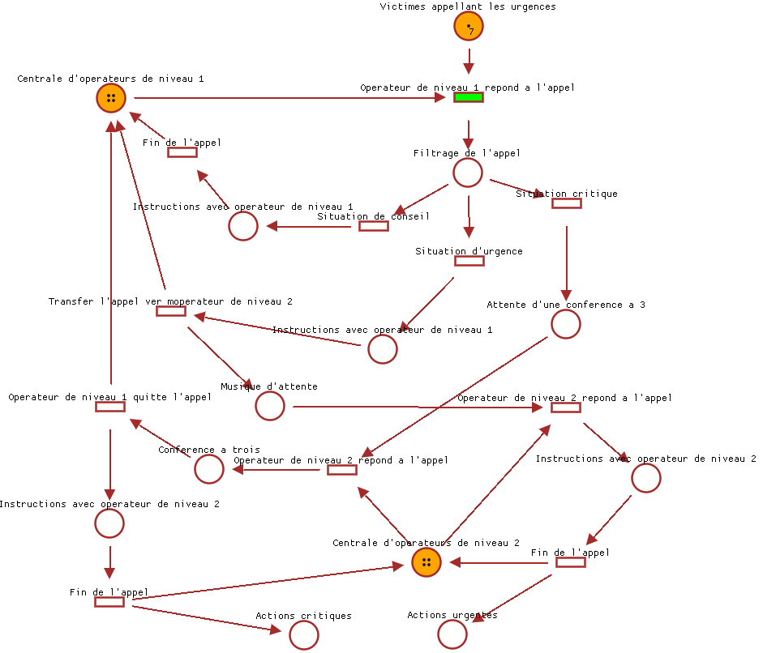

# Timed Petri Net Editor

[TimedPetriNetEditor](https://github.com/Lecrapouille/TimedPetriNetEditor) is a graphical interface for editing and running Petri nets. It offers some mathematics tools for timed event graphs which are a subclass of timed Petri nets with good mathematics properties for modeling discrete event systems with [(max,+) algebra](https://jpquadrat.github.io/).

**Note:** An online version is in gestation.
Here is the [link](https://lecrapouille.github.io/TimedPetriNetEditor/TimedPetriNetEditor.html).

## What are Petri nets, timed Petri nets, timed event graph, GRAFCET?

You can read this [internal document](doc/petri.md) for more information. Else you can go to [Related lectures and projects](doc/biblio.md).

## Application Overview

The following picture is an overview of the look of the application. You can click on it to watch a YouTube showing an example of timed Petri net running simulating emergency operators (French 911 call center) responding to people in distress. Operators of level 1 filter non-critical cases (advice). Operators of level 2 manage other cases: urgency and critical cases. For urgency cases, the operator of level 1 hangs up when he makes the victim wait the operator of level 2. For critical cases, the operator of level 1 waits with the victim until an operator of level 2 pick up before hanging up.

[](https://youtu.be/hOhunzgFpcA)

*Fig 1 - A timed Petri net (made with this editor).*

Why developing another Petri editor? Because:
- This project has started as a continuation of [ScicosLab](http://www.scicoslab.org/)'s (max,+) toolbox developed at INRIA (which is no longer developed) which missed a graphical Petri editor associated with (max,+) algebra.
- Many Petri net editors in GitHub are no longer maintained (> 7 years) or that I cannot personally compile or use (Windows system, Visual Studio compiler, C#, Java ..) or the code is too complex (no comments) to add my own extensions. This editor can be used for Julia language.

## Prerequisites

The editor can use [ZeroMQ](https://zeromq.org/) for remote control (JSON commands over TCP). This is enabled by default (`TPNE_ZEROMQ=1` in `Makefile.common`). To build without ZeroMQ:

```sh
make TPNE_ZEROMQ=0
```

When ZeroMQ is enabled, install the development package for your system before building:

**Fedora / RHEL / CentOS:**
```sh
sudo dnf install zeromq-devel
```

**Debian / Ubuntu:**
```sh
sudo apt install libzmq3-dev
```

**Arch Linux:**
```sh
sudo pacman -S zeromq
```

**macOS (Homebrew):**
```sh
brew install zeromq
```

You can verify that `pkg-config` finds the library with:

```sh
pkg-config --exists libzmq && echo "ZeroMQ OK"
```

## Compilation, Installation

```sh
git clone https://github.com/Lecrapouille/TimedPetriNetEditor --depth=1 --recursive
cd TimedPetriNetEditor/
make download-external-libs
make compile-external-libs
make -j8
sudo make install
```

## Developer note: `-ffast-math` and NaN/Inf

This project may be compiled with `-ffast-math` (see `PERFORMANCE_FLAGS` in `.makefile/rules/Makefile`), which implies `-ffinite-math-only`. Under this assumption the compiler considers that `NaN` and `±Inf` never occur, so `std::isnan()` / `std::isinf()` are constant-folded to `false` and direct comparisons such as `x == -inf` become unreliable. When you need to detect a special floating-point value (the `(max,+)` zero `-inf`, the `NaN` "no duration" sentinel of `Place -> Transition` arcs, ...), use the bit-pattern based helpers from [`src/PetriNet/SafeFloat.hpp`](src/PetriNet/SafeFloat.hpp) (`safeIsNaN`, `safeIsNegInf`, `safeIsPosInf`, `safeIsInf`) instead of the standard library functions.

## Usage

You can pass a Petri net file to the command line. See this [document](doc/save.md) concerning the description of the file format used for saving Petri net.

```sh
./build/TimedPetriNetEditor [data/examples/AppelsDurgence.json]
```

See:
- this [document](data/examples/README.md) showing some examples offered with this repo.
- ~~this [document](doc/gui.md) describing the mouse and key bindings for the graphical interface.~~
- ~~this [document](doc/mqtt.md) describing how to control the editor through MQTT commands.~~
- this [document](doc/export.md) Explaining how to export/import the net to/from other applications.

## Debug inside Visual Studio Code

Type F5 key to launch the application with a debugger. You can modify the `.vscode/launch.json` to indicate 

## Julia integration

The C++ files in [`src/julia`](src/julia) (`Julia.cpp` / `Julia.hpp`) build the C ABI shared library used by Julia. The Julia wrapper itself will live in its own package, [TimedPetriNetEditor.jl](https://github.com/Lecrapouille/TimedPetriNetEditor.jl), which drives this build (`Pkg.build`) and exposes the API:

```julia
using TimedPetriNetEditor
pn = petri_net()
petri_editor!(pn)
```

`TimedPetriNetEditor.jl` resolves the produced shared library automatically (no hard-coded path) and also adds the ScicosLab flowshop functions (`import_flowshop!`, `find_critical_cycle`, `show_cr_graph`) on top of [MaxPlus.jl](https://github.com/Lecrapouille/MaxPlus.jl).

You can read this [cheatsheet](doc/julia.md) concerning the API for Julia.
