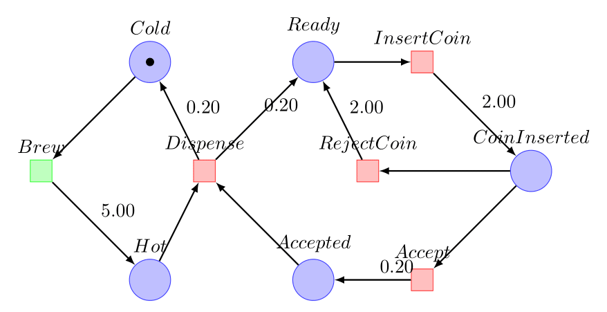
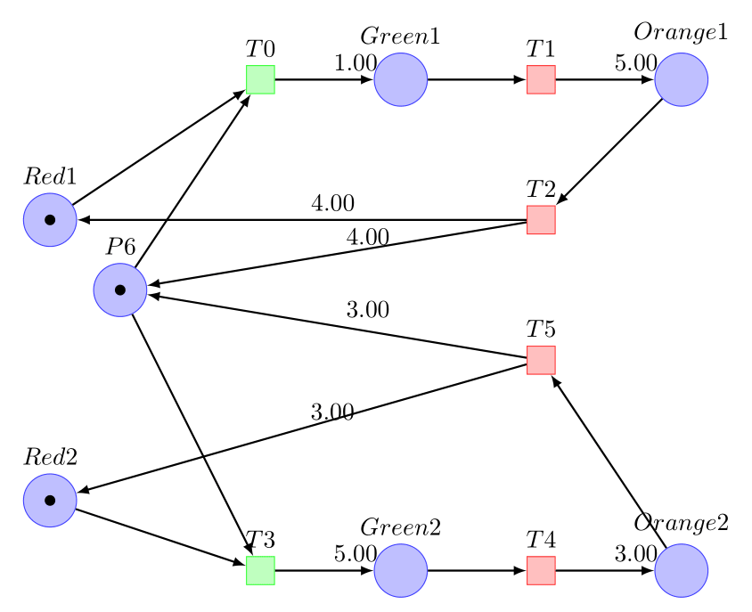
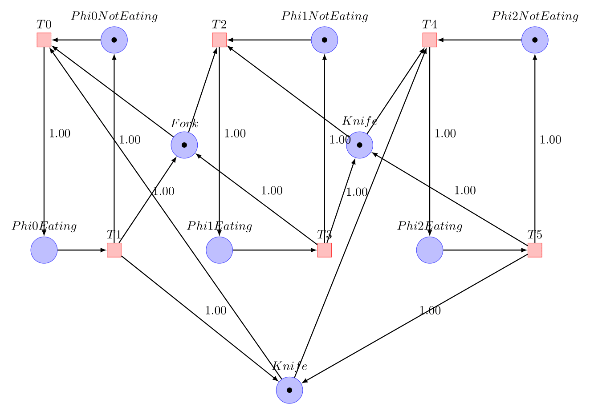
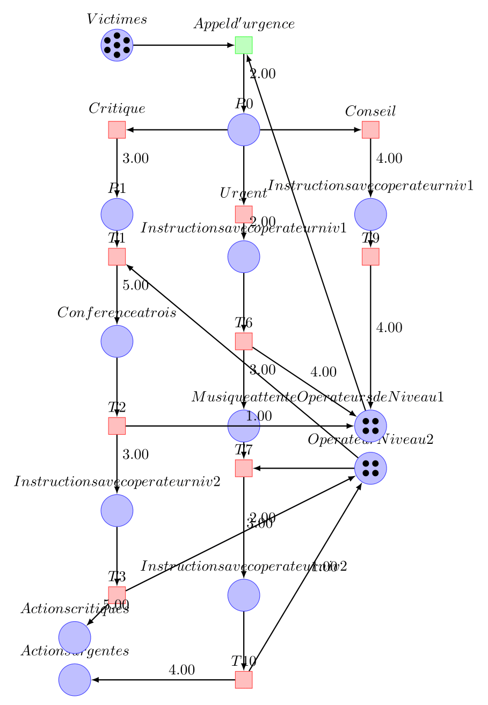
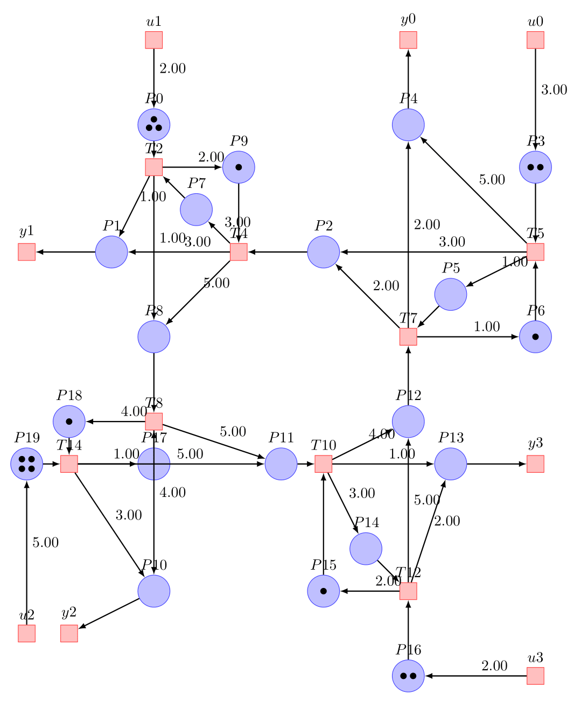
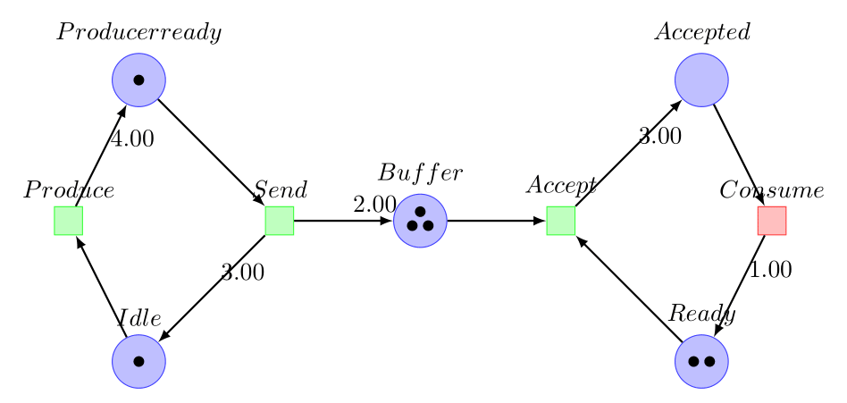
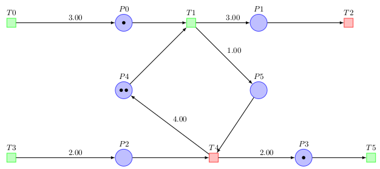
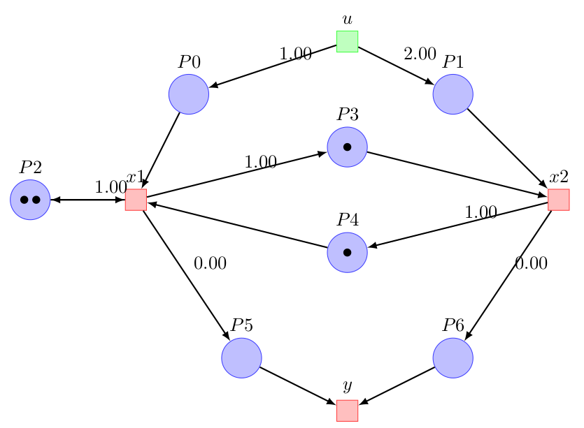

# Petri Net Examples

## GRAFCET Action Qualifiers

In GRAFCET mode, each step can have actions with different qualifiers that define their behavior according to IEC 60848:

| Qualifier | Name | Description |
|-----------|------|-------------|
| **N** | Normal | Action is active while the step is active |
| **S** | Set (Stored) | Action is latched ON when step becomes active, remains ON until Reset |
| **R** | Reset | Action is latched OFF when step becomes active |
| **D** | Delayed | Action becomes active after delay, only while step remains active |
| **L** | Limited | Action is active for limited duration while step is active |
| **SD** | Stored & Delayed | Action is set after delay (combination of S and D) |
| **DS** | Delayed & Stored | Action starts delayed, then stored (combination of D and S) |
| **SL** | Stored & Limited | Action is set for limited time (combination of S and L) |
| **P** | Pulse | Single pulse at step activation (impulse action) |

## GRAFCET with Actions (Cylinder Control)

This example demonstrates a pneumatic cylinder control sequence with various action qualifiers:
- **Init**: Initial waiting state
- **Extending**: Activates valve V1+ (Normal action)
- **Extended**: Starts a 2s timer (Delayed) and sets position indicator (Set)
- **Retracting**: Activates valve V1- (Normal) and resets indicator (Reset)
- **Alarm**: Sound buzzer (Normal) and flash lamp for 5s (Limited)

Sensors: `Start`, `s0` (retracted position), `s1` (extended position), `Error`, `Reset`

```
TimedPetriNetEditor data/examples/GrafcetActions.json
```

---

## Coffee machine

The client inserts a coin and press to the brew button to get a coffee.
The machine accept to return the inserted client coin.



```
TimedPetriNetEditor data/examples/Coffee.json
```

## Traffic Lights

Two traffic lights (red, orange, red lights) synchronized by the Place `P6`.



```
TimedPetriNetEditor data/examples/TrafficLights.json
```

## German Traffic Lights

One traffic ligth. The particularity of German traffic lights is they are at the same time red and yellow before swaitching to green.

```
TimedPetriNetEditor data/examples/GermanTrafficLights.json
```

Credit: YAWL User Group
https://www.youtube.com/shorts/ZQZCpDRqwKY

## Philosphers

Three philosophers are eating but they are sharing their fork and knives.



```
TimedPetriNetEditor data/examples/Philosophers.json
```

## Urgency Call (French 911)

Victims is calling the 911. A first operator (level 1) is selecting the type of urgency (advice urgent, critical):
- For an advice the operator is giving instructions to the victim.
- For a urgent case, the phone call is transfered to the operator of level 2.
- For a critical case, the phone call is transfered to the operator of level 2 but the operator of level 1 is still present with the victim.



```
TimedPetriNetEditor data/examples/AppelsDurgence.json
```

## Four Roads Junction

Simulate a road junction.



```
TimedPetriNetEditor data/examples/FourRoadJunctions.json
```

## Producer Consumer

Simulate a producer and a consumer with a buffer.



```
TimedPetriNetEditor data/examples/ProducerConsumer.json
```

## Inputs Outputs

Show source and sinks transitions



```
TimedPetriNetEditor data/examples/InputsOutputs.json
```

## Event Graph

Show a timed event graph taken from
https://www.rocq.inria.fr/metalau/cohen/SED/book-online.html.



```
TimedPetriNetEditor data/examples/EventGraph.json
```

## Chainsaw Safety

Show security such as dead man works on a chainsaw.

```
TimedPetriNetEditor data/examples/Chainsaw.json
```

Credit: YAWL User Group
https://www.youtube.com/shorts/V42WiF2Ib3w

## Landing Gear

Show how to prevent damaging aircraft landing gear.
- The aircraft has initially its gear down and at low speed.
- On high speed, extending gears is not possible.
- If gears are down and aircraft go to high speed a warning is triggered.


```
TimedPetriNetEditor data/examples/LandingGear.json
```

Credit: YAWL User Group
https://www.youtube.com/shorts/IqMyF5JKoE4

## Smarthome Safety

Prevent shuttering down the last roller shutters.

```
TimedPetriNetEditor data/examples/SmarthomeSafety.json
```

Credit: YAWL User Group
https://www.youtube.com/shorts/BB5N9Nxtq00
