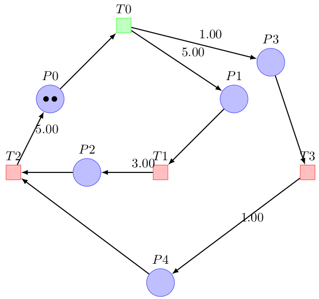
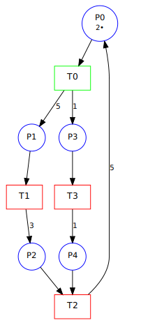

# Exporting and importing the net to other file format

## Export to LaTeX

The Petri net can be exported to a LaTeX file. The application will
ask you where to save the file. For LaTex a `.tex` file is created, and you can compile
it with a command like `latex LateX-gen.tex; dvipdf LateX-gen.dvi`.



*Fig 4 - Canonical Event Graph exported in LaTex.*

You have to install an application for example for Linux:
`sudo apt-get install texlive-base`.

## Export to Graphviz

The Petri net can be exported to a Graphviz file. The application will
ask you where to save the file. For LaTex a `.dot` file is created.

You have to install an application for example for Linux:
`sudo apt-get install xdot`.



*Fig 5 - Canonical Event Graph exported in Graphviz.*

## Export to Draw.io

Can export to input files for [Draw.io](https://app.diagrams.net).

## Export to Symfony workflow

Can export to input files for [Symfony workflow](https://symfony.com/doc/current/components/workflow.html).

## Export/Import to pn-editor

Can export to input files for [pn-editor](https://gitlab.com/porky11/pn-editor).

You have to git clone and install it manually.


## Export to C++ code

If your net is a GRAFCET (GRAphe Fonctionnel de Commande Etapes-Transitions in French,
aka Sequential Function Chart (SFC) in English) you can generate the C++ code.
More details [here](grafcet.md).

## Export to Timed Graph Event

Store timed event graph in a compact format. The file format is based this initial [project](http://www.cmap.polytechnique.fr/~gaubert/HOWARD2.html). We are using the
`.teg` extension.

The first line indicates if we are using "TimedEventGraph", the number of transitions and the number of arcs (which is equals to places / 2). Other lines define each arcs transition to transition, the number of tokens in the place relying the two transitions and the duration. All values are unsigned integer execept for duration which are float.

Timed event graph file format:

```
TimedEventGraph <number of arcs> <number of arcs>

<initial transition id> <destination transition id>: <duration> <number of tokens>.
```