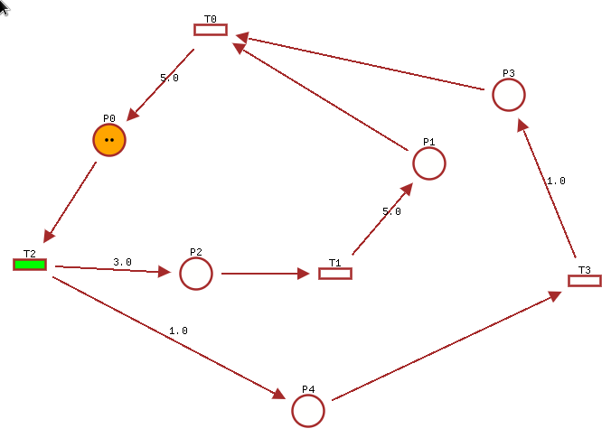
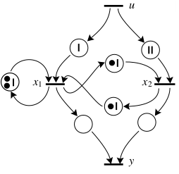
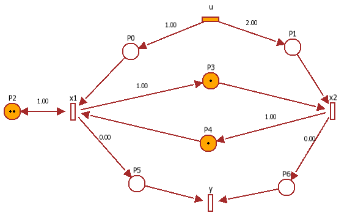
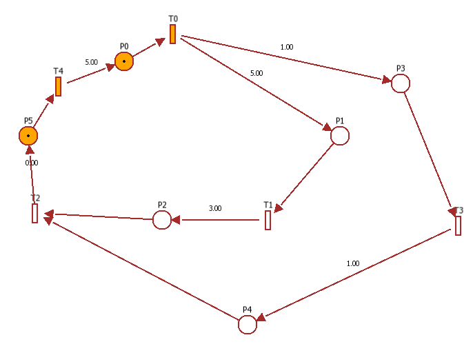
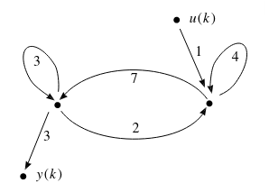
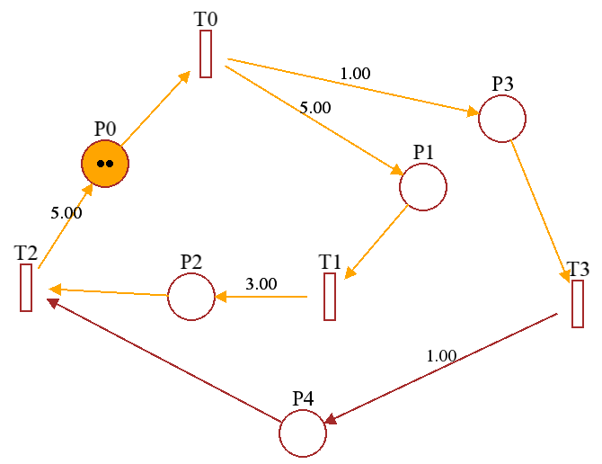
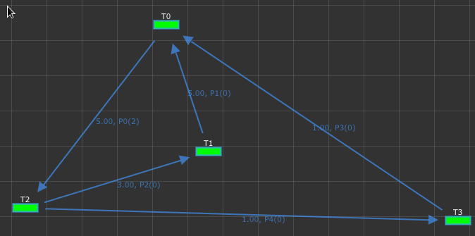

# What are Petri nets, timed Petri nets, timed event graph?

## Petri nets and timed Petri nets

Petri nets are one of several mathematical modeling languages for the
description of distributed systems and synchronization of their processes. It is
a class of discrete event dynamic systems.

A Petri net is a directed bipartite graph that has two types of nodes: places
and transitions respectively depicted as circles and rectangles. A place can
contain zero or any positive number of tokens, usually depicted either as black
circles or as numbers. Arcs, depicted as arrows. An arc allows directing two
nodes of different types: either from a place to a transition or from a
transition to a place. In timed Petri nets, "place -> transition" arcs are
evaluated with a strictly positive duration value which simulates the time needed
by the place to perform the associated action. A transition is activated if all
places connected to it as inputs contain at least one token. When a transition
is activated a token is burnt from each of these places and added to each place
connected as outputs to this transition.

Usually, the numbers of tokens in places depict the states of the systems,
tokens represent the resources of the system and transitions describe the
synchronization of resources (rendez-vous). Petri is another way to model state
machines.

In above figure 1, there are 5 transitions (`T0, T1, T2, T3, T4`) and 4
places (`P0, P1, P2, P3`). Places `P0` and `P1` have 1 token each, the place
`P1` has 2 tokens and the place `P3` has no token. The arc `T0 -> P1` has 3
units of times to simulate the fact that `P1` will need this duration to perform
its action. Transitions `T0, T1, T2, T4` are activated but the transition `T3` is
not activated.

**Note to developers concerning unique identifiers**

In this editor, for a given type (place and transitions), unique identifiers are
unsigned integers `0 .. N`.  Numbers shall be consecutive and without
"holes". This is important when generating graphs defined by adjacency
matrices: indices of the matrix will directly match unique identifiers and
therefore no lookup table is needed. To distinguish the type of node a `T` or
`P` char is also prepended to the number. Arcs have no identifier because their
relation to directing nodes is unique since this editor does not manage multi
arcs. Therefore, when deleting a place (or a transition) the latest place (or
latest transition) in the container gets the unique identifier of the deleted
element to guarantee consecutive identifiers without "holes".

## Dynamic simulation

When running the simulation with this editor, tokens will transit along the arcs of
the net. When transitions are activated, tokens are instantaneously burnt from
places and directly "teleported" to transitions. Then, they will move along the
arc from the transition to the place. This "travel" will hold the number of
seconds indicated by the arc. This symbolized the time needed for the Place to
perform its action. A fading effect will help to show you which arcs and
nodes are activated.

Notes:
- Duration of animations is not yet normalized, so a short duration will make
  the GUI blink.
- To simulate a classic Petri net, simply set all duration in arcs to 0.
- Inputs generating periodically tokens are currently not implemented. For the
moment, during the simulation, you can place your mouse cursor to any place and
with `+` key you can add a token this will mimic input generating tokens.
- For outputs, simply add transitions without successors. Tokens will be
definitively deleted from the simulation.

## What decision is made when several transitions can burn tokens from the same place?

Question: In above figure 1, the place `P1` has two tokens and has two
leaving arcs `P1 -> T1` and `P1 -> T2`. How transitions `T1` and `T2` will burn
tokens in `P1` and therefore in which arc tokens will transit to?

Answer: Unless you want to simulate a system with concurrences between resources,
this kind of net is a bad design and should be avoided when architecturing real
systems since the execution of this kind of Petri net is nondeterministic: when
multiple transitions are enabled at the same time, they will fire in any
order. Therefore you should adapt your Petri net to define uniquely
the trajectory of the token.

A nondeterministic execution policy is made at the discretion of the developer of
the editor and you will have different behavior depending on how the editor has
been developed. Currently in our case, initially, the order when iterating on
transitions and arcs only depends on their order of creation but now we
randomize.  When several places are fired, the maximum possible of tokens will
be burned within a single step of the animation cycle but, internally, we iterate
over tokens one by one to help dispatch them over the maximum number of arcs.
Therefore, in this particular example, since `T1` has been created before `T2`
(unique identifiers are incremented by one from zero and there is no gap), the
1st token will go to `T1` and the second will go to `T2`. If `P1` had a single
token, in early `T1` will always be chosen but in the latest version, we randomize.

# What are Timed Graph Events?

A timed event graph is a subclass of Petri net in which all places have a single
input arc and a single output arc. This property allows to forbid, for example,
the or-divergent branching (choice between several transitions), and therefore
concurrency is never occurring. Transitions still may have several arcs because
they simulate synchronization between resources. Places can have zero or several
tokens. In above figure 1, the net is not an event graph since `P0` has 3
incoming arcs and `P2` has two output arcs but the following figure 2 is an
event graph. Timed Graph Events are interesting for designing real-time
systems as explained in the next sections.



*Fig 2 - Event Graph (made with this editor).*

Inputs of event graphs are transitions with no predecessor. Outputs of event
graphs are transitions with no successor. In figure 2, there are no inputs
and no outputs.

## Other look of event graph in literature

In [literature](https://www.rocq.inria.fr/metalau/cohen/SED/book-online.html)
timed event graphs are displayed with vertical bars inside places: they indicate
holding times of these places (in time units). In our net editor bars are displayed
as numbers on arcs going to places. For example, this net:



*Timed Event Graph with vertical bars.*

is the same than this net:



*Timed Event Graph (made with this editor).*

## Dater and Counter Form

Event graphs represent when system events are occurring. We have two different
way to represent them: the counter form, and the dater form.

- The counter form of the event graph in figure 2 is:
```
T0(t) = min(2 + T2(t - 5))
T1(t) = min(0 + T0(t - 5))
T2(t) = min(0 + T1(t - 3), 0 + T3(t - 1))
T3(t) = min(0 + T0(t - 1))
```

where `t - 5`, `t - 3` and `t - 1` are delays implied by duration on arcs and
`min(2 +` and `min(0 +` implied by tokens from incoming places.

- The dater form of the event graph in figure 2 is:
```
T0(n) = max(5 + T2(n - 2))
T1(n) = max(5 + T0(n - 0))
T2(n) = max(3 + T1(n - 0), 1 + T3(n - 0))
T3(n) = max(1 + T0(n - 0))
```

where `n - 0` and `n - 2` are delays implied by tokens from incoming places and
`max(5 +`, `max(3 + ` and `max(1 +` are implied by duration from incoming arcs.

In both cases, these kinds of formulas are not easy to manipulate and the (max,+)
algebra is here to simplify them. This algebra introduces the operator ⨁ instead
of the usual multiplication in classic algebra, and the operator ⨂ (usually
simply noted as `.` or without symbol) instead of the usual `max()` function in classic
algebra. The (min,+) algebra also exists (the operator ⨂ is the `min()`
function) and for more information about (max,+) algebra, see my
[MaxPlus](https://github.com/Lecrapouille/MaxPlus.jl) Julia package which
contains tutorials explaining more deeply this algebra.

The (min,+) algebra, for event graphs, is less convenient since the dater form is
more friendly than the counter form for two reasons:
- on a real-time system the number of resources (tokens) is reduced compared to
  duration needed to perform tasks (duration on arcs) which can be arbitrary
  long (for example 2 resources (2 delays) versus 2 hours when your system is
  scheduled at 1 Hz (7200 delays). Remember that in a discrete-time system each
  delay costs one variable (memory) to hold the value.
- thanks to the canonical form (explained in the next section) delays can
  simplify be either 0 or 1.

- The counter form of the event graph in figure 2 is:
```
T0(t) = 2 T2(t - 5)
T1(t) = T0(t - 5)
T2(t) = T1(t - 3) ⨁ T3(t - 1)
T3(t) = T0(t - 1)
```

- The dater form of the event graph in figure 2 is:
```
T0(n) = 5 T2(n - 2)
T1(n) = 5 T0(n)
T2(n) = 3 T1(n) ⨁ 1 T3(n)
T3(n) = 1 T0(n)
```

## Canonical Event Graph

An event graph is said canonical when all places have at most one token and when
places after an input transition (meaning a transition without predecessor) have
no token and when places before an output transition (meaning a transition
without successor) have no token. Any event graph can be transformed to its
canonical form: a place with N tokens can be seen as N consecutive places
holding each a single token. For system inputs and system outputs having one
token in place, we can simply add an extra empty place.

The graph in figure 2 is not canonical since `P0` has two tokens. The following
figure is the same event graph but in its canonical form: one token `P0` has
been transferred to the newly created `P5` place.



*Fig 3 - Canonical Event Graph (made with this editor).*

A canonical event graph can directly be converted into an implicit dynamic
linear systems inside the (max,+) algebra (see section after) but since editing
canonical net is fastidious and therefore the editor will deal it and let the
user can directly manipulate the compact form of event graph.

## Implicit max-plus Dynamic Linear Systems

Canonical event graphs are interesting since their dater form can be modeled by
an implicit dynamic linear system with the (max,+) algebra, which has the
following form:

```
    X(n) = D ⨂ X(n) ⨁ A ⨂ X(n-1) ⨁ B ⨂ U(n)
    Y(n) = C ⨂ X(n)
```

Or using the compact syntax:
```
    X(n) = D X(n) ⨁ A X(n-1) ⨁ B U(n)
    Y(n) = C X(n)
```

In where `A, B, C, D` are (max,+) matrices: `B` is named controlled matrix, `C`
the observation matrix, `A` the state matrix (places with 1 token), and `D` the
implicit matrix (places without token). `U` the column vector of system inputs
(transitions with no predecessor), `Y` the system outputs (transitions with no
successor), and `X` the systems states as a column vector (transitions with
successor and predecessor), `n` in `X(n)`, `U(n)`, `Y(n)` are places with no
token, and `n-1` in `X(n-1)` are places having a single token. Note: that is
why, in the previous section, we said that canonical form has its input and
output places with no token. This editor can generate these (max,+) sparse
matrices (for Julia), for example from figure 3:

```
    | .  .  .  .  . |       | .  .  .  .  5 |
    | 5  .  .  .  . |       | .  .  .  .  . |
D = | .  3  .  1  . |,  A = | .  .  .  .  . |
    | 1  .  .  .  . |       | .  .  .  .  . |
    | .  .  .  .  . |       | .  .  0  .  . |

```

Since this particular net has no input and outputs, there are no U, Y, B, or C
matrices. Note: `.` is the compact form of the (max,+) number `ε` which is the
`-∞` in classic algebra means that there is no existing arc (usually, these
kinds of matrices are sparse since they can be huge but with few elements
stored).  Let's suppose that matrix indices start from `0`, then `D[2,3]` holds
the duration 1 (unit of times) and 0 tokens (the arc `T3 -> P4 -> T2`).  `A[0,4]`
holds the duration 5 (unit of times) and 1 token (the arc `T4 -> P0 -> T0`).

`[i,j]` (of matrices `A, B, C, D`) refers to the arc `Tj -> P -> Ti`. Note, the
direction is inversed because of matrix multiplication `A x`.

Let give an example with inputs and outputs. The following figure 5 show an network
with one input and one output.


*Fig 5 - Network with one input and one output (made with this editor).*

and corresponds to this graph:



The matrices are:

```
    | .  . |      | 3  7 |      | . |
D = | .  . |, A = | 2  4 |, B = | 1 |, C = | 3 . |
```


These kinds of systems are interesting for real-time systems because they can show
to the critical circuit of the system (in duration). The algorihm used is [Howard](http://www.cmap.polytechnique.fr/~gaubert/HOWARD2.html). This editor can show the
a critical circuit as shown in the next figure 5 where the circuit `T0, T1, T2`
will consume 13 units of time (5 + 5 + 3) for two tokens (in `P0`) and therefore
6.5 units of time by token (this information is for the moment displayed on the
console).



*Fig 5 - The critical circuit in orange (made with this editor).*

## Compact form of timed event graphs

Thanks to the property of event graphs in which places have a single input arc
and single arc, another way to represent event graphs in a more compact form, is
to merge places with their unique incoming and unique out-coming arcs. From
figure 2, we obtain the following figure 3, which is a more compact graph but
equivalent. For example, the arc `5.00, P0(2)` means the place `P0` with 2 tokens
and 2 units of time for the arc `T2 T1`.



*Fig 3 - A compact form of figure 2 (made with this editor).*

Since, graphs can be represented by adjacency matrices, and since, arcs hold two
information (duration and tokens), event graphs can be represented by two
matrices (generally sparse): one matrix for duration `N` and the second matrix
for tokens `T`. And since, event graphs have good properties with the (max,+)
algebra, this editor can generate this kind of matrix directly in this algebra
which can be used by the [MaxPlus](https://github.com/Lecrapouille/MaxPlus.jl)
Julia package.

```
    | .  .  2  . |       | .  .  5  . |
    | 0  .  .  . |       | 5  .  .  . |
T = | .  0  .  0 |,  N = | .  3  .  1 |
    | 0  .  .  . |       | 1  .  .  . |
```

Let suppose that matrix indices start from `0`, then `T[0,2]` holds the value 2
token and `N[0,2]` holds the duration 5. The `[0,2]` means the arc `T2 -> T0` in
the compact form (or arcs `T2 -> P0` and `P0 -> T0` in the classic Petri form).
Note that origin and destination are inversed, this is because the matrix
convention is generally the following: `M . x` with `x` a column vector. This
editor can generate some Julia script. Note that `ε` in (max,+) algebra means
that there is no existing arc.
