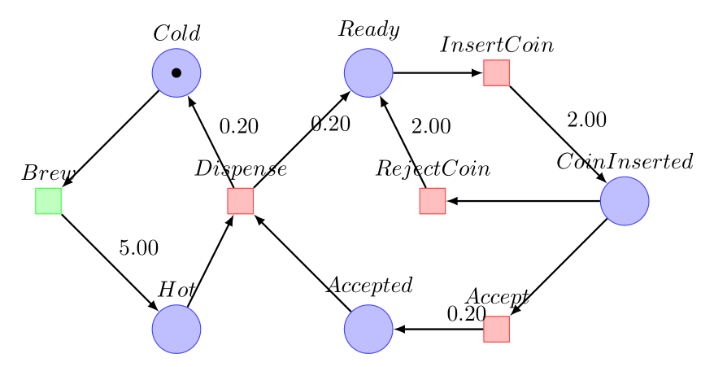
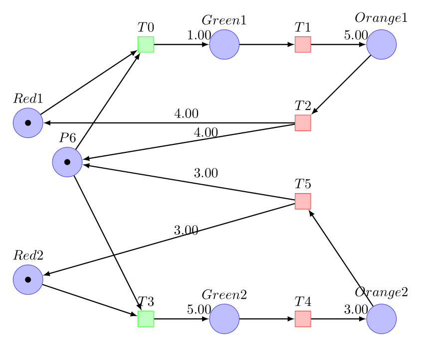
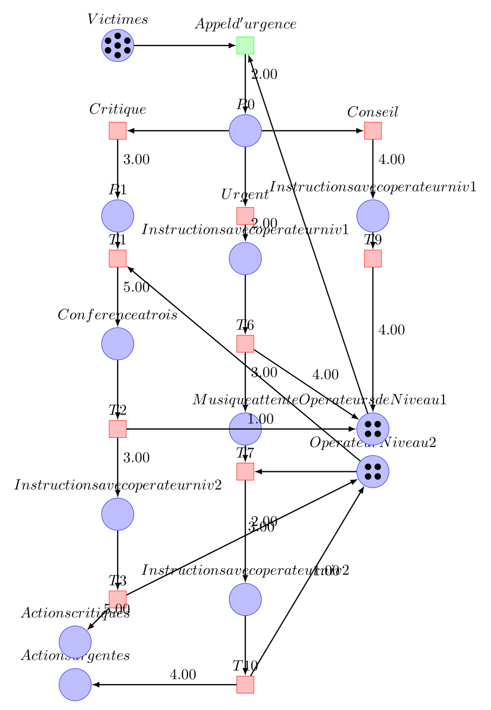
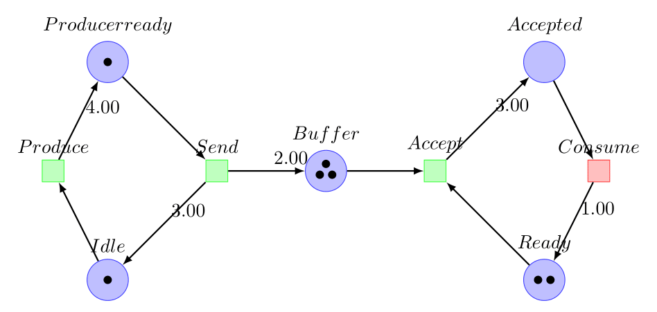

# Petri Net Examples

## Coffee machine

The client inserts a coin and press to the brew button to get a coffee.
The machine accept to return the inserted client coin.



```
TimedPetriNetEditor -p examples/Coffee.json
```

## Traffic Lights

Two traffic lights (red, orange, red lights) synchronized by the Place `P6`.



```
TimedPetriNetEditor examples/TrafficLights.json
```

## Philosphers

Three philosophers are eating but they are sharing their fork and knives.


```
TimedPetriNetEditor -p examples/Philosophers.json
```

## Urgency Call (French 911)

Victims is calling the 911. A first operator (level 1) is selecting the type of urgency (advice urgent, critical):
- For an advice the operator is giving instructions to the victim.
- For a urgent case, the phone call is transfered to the operator of level 2.
- For a critical case, the phone call is transfered to the operator of level 2 but the operator of level 1 is still present with the victim.



```
TimedPetriNetEditor -p examples/AppelsDurgence.json
```

## Four Roads Junction

Simulate a road junction.


```
TimedPetriNetEditor examples/FourRoadJunctions.json
```

## Producer Consumer

Simulate a producer and a consumer with a buffer.



```
TimedPetriNetEditor examples/ProducerConsumer.json
```
